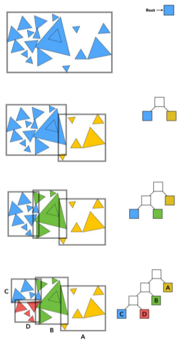

可见面检测（visible surface determination,VSD）
找出在最终渲染画面中应绘制的三角形
或者找出不应被绘制的三角形。

# 包围盒检测

# 四叉树和八叉树

# BSP树

# BVH树
bvh有体积信息，八叉树没有

与 k-d tree 相同的是，BVH 在建树时也需要做划分，满足如果射线不穿过父节点，那么肯定不穿过子节点。但是划分不是在空间结构上，而是对物体的集合做划分。这也就导致空间会重合。

查询跟 k-d tree 一样，就不赘述了。
# 遮断剔除

