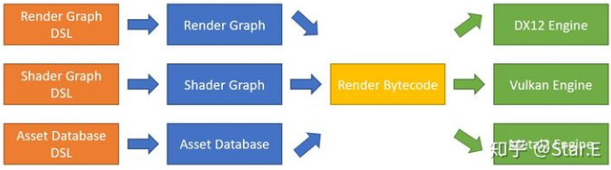
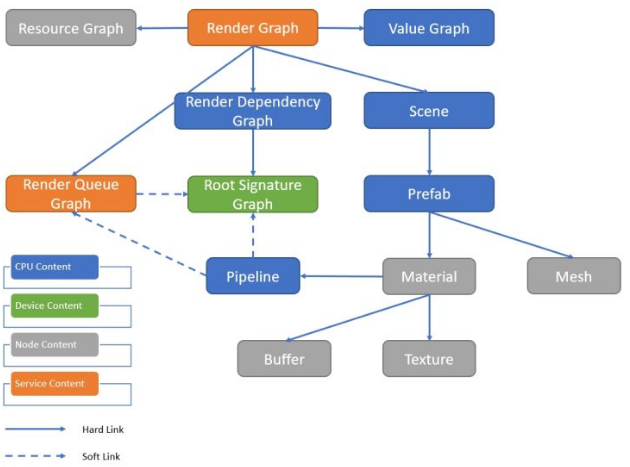

# 游戏引擎开发新感觉！
RHI参考
https://github.com/bkaradzic/bgfx

没有RHI如何让用户使用同一份代码跨平台？我看你回复里说不同平台各自实现虚拟机 是在说让用户的脚本统一，虚拟机使用不同的平台API吗？那这个虚拟机不就是个RHI吗？
rhi粒度很细，每个图形api都要暴露。bytecode粒度很粗，比如一条指令可能只有“画地形”，怎么画交给虚拟机了，不同虚拟机会有不同实现。


我只想写引擎本身，pipeline和光照想让用户实现。StarEngine只是个工具，让人方便地实现算法原型
pipeline让用户实现? 引擎只是对render api做个封装么
pipeline由用户实现。我们会提供一个dsl，帮助用户实现想要的功能。不会对render api做封装，当然各种数据的descriptor还是封装了的

有点像java，用户代码还是一套，但每个平台有自己的虚拟机，差不多是这种感觉。这里的dsl不是游戏脚本，逻辑不用这个写。总之以后会详细介绍哒。


还有我觉得分层设计比单一个配置层要好，比如一个材质，策划层（调调参数），美术层（基于shader graph的材质制作），技术层（shader 和 shader library 等）和专家层（shading model 和 render pipeline 等），可以参考 unity 的设计思路。当然这么搞的工作量挺爆炸的23333。
嗯，这个分层很合理。StarEngine专注技术层与专家层。这两个在引擎里是统一设计的

看到把"零开销抽象"写到第一位我想吐个槽, 下面的各种追求好多都跟"零开销抽象"相悖的, 如"不用的功能,不增加开销"和"通过脚本配置的方式来声明意图,实现效果"就很矛盾, 数据驱动就意味着引擎没法知道有哪些不用的功能,只要数据能驱动的功能都得做判断和支持. 所以我感觉"零开销抽象"只能作为优先级最低的追求了.
zero-overhead并不是zero-cost，是指实现相同功能的情况下，很难手写的更好。数据驱动肯定是有开销的，我们希望在数据驱动的情况下，开销最小。如果愿意放弃数据驱动带来的（热更）便利性，我们可以把数据进一步翻译成c++代码，这样不需要的功能就可以从运行时完全移出了。


不知道材质shader部分会怎么设计来做到平台独立了，bgfx或vulkan虚拟机应该不错，这样就简单跨平台渲染了，想等渲染部分发上去自己做试试看，日常用mac还想试试在mac上编译，当然vulkan做出来moltenvk也要试的，有个平台能自己瞎jb定制化最好了

# 引擎架构篇
其实个人认为游戏引擎底层的内存分配措施可以有很多套，不同的分配频率，分配大小，分配体积差异，这些应该最优解都不同。
你说的都对，这个问题c++17有个（近似）完美解，哈哈。写runtime的时候会介绍。
pmr？
被剧透了，就是polymorphic_allocator和memory_resource


请问一下为什么引擎的runtime部分不会开启rtti
不会用到rtti，关了省二进制大小。不管也行的，这是个小优化。

# 渲染引擎篇

渲染引擎的设计

1. 对于shader，我们会有shader graph提升shader的生产力。
2. 对于render pipeline，我们会<font color=red>有render graph增强管线的可定制性。</font>
3. 对于场景组织与gpu数据递交，我们想交由用户灵活实现。
4. 对于资源，我们想抽象出跨平台的资源描述，方便客户端、编辑器、DCC使用。

说起来，render graph + shader graph这并不新鲜嘛，其他引擎也是这么设计的。这里简单阐述下：render graph/frame graph的出现是由现代图形api决定的。<font color=red>现代图形api把资源状态、利用情况交给了用户决定，然而这些状态跟踪起来过于繁琐以至于根本无法手动管理，所以一定会催生那么个render graph进行统筹。</font>这是api的内蕴属性，所以大家的设计一定是趋同的。shader graph也是同理。但是这些算法如何实现，各引擎的处理方式是各不相同的；如何使用，也将是各不相同的。StarEngine会探索其中的一条道路，这里应该是区别于其他引擎的。

总之，StarEngine会对渲染引擎进行激进的重新设计：

1. 数据驱动。连渲染框架整体，都是数据驱动的。修改渲染管线，比如从forward到deferred，一键发布不需要编译引擎/客户端。
2. 非oop。主要模块统统静态化，我们用更长的编译时间换取更全面的静态检查、静态多态、静态反射，多重分发(multiple-dispatch)。完全去掉继承结构、依赖注入、动态反射、rtti。以此简化代码结构，避免深邃难懂的继承层次。
3. 不抽象rhi。针对d3d12、vulkan、metal2各写一套代码，争取做到对图形api的全方位支持（毕竟可以硬写）。消除用户学习rhi的额外负担。
4. 编辑时决定。在编辑时决定一切（渲染）资源利用情况，预先决定好内存、gpu使用、线程调度顺序。争取在运行时做到0内存分配、吞吐量最大。
5. 图形/逻辑分离。逻辑部分只能“设置参数”，不能更改图形流程。将图形和逻辑开发完全解耦。


## 渲染引擎的使用


大致是用户通过各类DSL（Domain Specific Language）描述渲染框架
shader算法、资源利用情况。然后交给各个编辑器进行离线编译，组合生成render bytecode。最后各平台的渲染引擎读取bytecode并执行。
所以渲染部分是不需要代码参与的，可以热更新。
并且我们把引擎的设计、验证、实现、执行进行完全解耦，以此方便修改和迭代。

注意：我们只是数据驱动（执行），做不到数据驱动（数据），有些问题暂时不好处理。比如动态大小的render target（我们是预编译好的render pipeline数据，运行时没法改变，只能选取大小合适的pipeline)。我们暂时不解决这个问题。

想到这些工作量还有深度我就害怕，所以我只敢瞎搞搞2d的玩玩，还能试验些<font color=red>frp之类的骚概念。</font>

其实render pipeline也是不需要的，根据项目需求让用户自己写就行了，这样最灵活了

# C++
同时了解c++11的以下几个特性：

1. 右值引用/移动语义。移动语义我觉得是现代c++的基石。正是有了移动语义，c++的生命周期管理才变得合理起来。在继续阅读剩下的篇章之前，请务必全面掌握右值引用与移动语义，特别是构造函数的各类规则。
2. auto（自动类型推导）。有人说auto影响代码阅读，这个确实是这样。不过用了auto之后，类型的重命名变的简单起来，不用一个个地方改啦。我们能用auto的地方一定会用auto，就是为了重命名方便。我们之后会发现，命名对于编程来说真的很难，经常会重命名，所以auto一定要有。不过我们auto的用法很简单，只用到最基础的功能。
3. lambda（匿名函数）。c++的匿名函数是个很棒的语法糖，用[](){}三种括号就实现了功能，堪称艺术。配合algorithm、boost::asio使用，效果更佳。
4. variadic template（可变参数模板）。可变参数模板才是模板编程的完全体，03版的很多写法可以遗忘啦！可惜我们基本不会写模板类，不过使用标准库时还是会遇到，希望大家看到一大堆模板参数和parameter pack时不要紧张哦。


## type alias
我们在SMathFwd.h里前置声明了数学类型的一些缩写，比如Vector4f，Matrix4f之类的。

文件里我们用到了很多using关键字，比如
```
using Vector4f = Eigen::Matrix<float, 4, 1>;
// typedef Eigen::Matrix<float, 4, 1> Vector4f; // 效果同上
```

这是c++11引入的类型别名（type alias）的功能，原理和typedef一样。现在可以用using完全替代typedef哦。

用using的最大好处是，模板也能有别名啦（alias template），以前是不可以的！我们可以用alias template简化模板类型的声明，比如SMap.h中我们用了using Map简化std::map的使用。
```
template<class Key, class Value>
using Map = std::map<Key, Value, std::less<>>;

template<class Value>
using StringMap = std::map<std::string, Value, std::less<>>;
```
这里的Map只有2个模板参数Key和Value了，StringMap更是只有一个参数Value。不过要注意，实际的类型还是std::map哦。我们并没有创建新的template类型，这里只是别名。

眼尖的读者可能发现了，std::map的模板参数里混入了std::less<>这种不可名状的类型。这里可不是笔误，这是c++14引入的：

## transparent comparator
简单来讲是这样的：对于std::map<std::string, int>，如果我们要用find这个函数，key的类型必须是std::string，或者key能隐式构造std::string。这用起来非常不方便，更糟糕的是，构造std::string会造成额外的消耗！用了std::less<>之后，key只要能和std::string比较就行啦，不会额外构造std::string！我们项目中类似std::map的容器，都会优先用std::less<>。
```
std::map<std::string, int> dictionary;
auto iter1 = dictionary.find(std::string_view("star")); // 编译不过
auto iter2 = dictionary.find(std::string(std::string_view("star"))); // 编译通过

Map<std::string, int> dictionary2; // Map的定义详见type alias的代码
auto iter3 = dictionary2.find(std::string_view("star")); // 编译通过
```
上面的示例中，眼尖的读者又会发现新类型std::string_view，这是c++17引入的

## std::string_view
string_view顾名思义，就是string的view（笑）。std::string_view记录了字符串起始地址与长度，实现差不多相当于std::pair<char*, size_t>。可以指向字符串中间的一部分，所以不一定是\0结尾的哦。注意不能用std::string_view隐式构造std::string，但反过来是可以的。上面那个例子里，由于std::string_view不能隐式构造std::string，所以std::map的find编译失败了呢。

std::string_view还有很多其他用法，比如以前经常会纠结，函数参数是用const char*还是const std::string&，两者不太兼容。现在可以用std::string_view啦，用值传才是正确的用法哦。

```
void printValue(std::string_view name);
```
当然，因为std::string_view不拥有字符串的所有权，所以会出现被引用的字符串意外析构的情况，造成野指针。为了避免这情况，我们规定任何对象不得拥有std::string_view成员。std::string_view最好只出现在函数参数里，或者作为临时变量。

## 小结
当我们用上type alias、transparent comparator、std::string_view这三个功能后，std::map被完全改造啦！性能更好、使用更方便。c++就是有这样的魔力，新特性能把老语言改的面目全非，搞的每次都像学新语言一样（捂脸）。

比如在SMap.h里我们还看到了其他的类型别名，它们都有pmr这三个字母。

```
template<class Key, class Value>
using PmrMap = std::map<Key, Value, std::less<>,
    std::pmr::polymorphic_allocator<std::pair<const Key, Value>>
>;

template<class Value>
using PmrStringMap = std::map<std::pmr::string, Value, std::less<>,
    std::pmr::polymorphic_allocator<std::pair<const std::pmr::string, Value>>
>;
```
pmr是polymorphic memory resource的缩写，这是c++17引入的内存分配器相关的功能，也会把老语言变成新语言哦。这个问题比较大，我们以后再讲吧。


自string literal构造string_view的话，可以直接用14的user defined literal特性，17标准库已经提供了sv后缀，<font color=red>"hello world"sv</font>就行，不用string_view("hello world")


游戏开发用到RTTI，反射的场景也不少吧，尤其是游戏逻辑脚本化的情况
设想是逻辑交给脚本语言了，脚本可以有反射。


# 基于图的游戏引擎架构

StarEngine引入了更多的Concept,来解决引擎开发中的常见问题.
1.Named Graph:Vertex有名字的图.


有没有基于图的管理场景物体的数据结构

其实树就是一种图。


## 执行图
是对硬件平台的抽象

现在的游戏对图形引擎非常苛刻，有以下一些需求必须满足。

1. 跨各个硬件平台。移动平台需要低功耗、PC、主机平台需要挖性能。
2. 对低、中、高配有足够的伸缩性，良好的硬件兼容性。
3. 对不同的游戏类型，图形算法管线各不相同，需要差异化。
4. DCC要求快速迭代，需要实时预览+快速烘培。

这些需求是互相矛盾的，一种硬件架构不能满足全部需求。引擎需要对硬件平台进行适当抽象、使得其可更改、可配置。

首先Executor Graph满足Ownership Graph概念，这是对硬件父子关系的抽象。

其次Executor Graph是一个网络，不同节点(Vertex)之间可以传输数据（带宽不同）、可以进行Gpu/Cpu同步。

有了Executor Graph，我们可以根据不同平台、不同配置、不同算法、不同用途，自定义合适的硬件架构。比如：

1. 对于双显卡的笔记本电脑，我们可以在集成显卡上算动画，然后在独立显卡上渲染。
2. 对于美术用的工作站，我们可以在一块显卡上预览，在另一块显卡上实时烘培。
3. 对于烘培用的工作站，我们可以完全使用4路Gpu加速烘培，减少迭代时间。
4. 对于移动平台，我们可以用最简单的架构，获得最好的兼容性和低功耗，也可以对主流机型进行特别适配。
5. 对于主机平台，我们可以选择一个最优化的架构，挖掘平台的极限性能。

在合理的抽象上，<font color=red>Executor Graph隐藏掉实现细节，用户可以通过声明式的编程加以控制，自动化、简化开发。<font>


## 内容图Content Graph
是对各类内容(Content)的抽象，其建立在Executor Graph之上，相关性很高，因为资源都是存放在硬件上的。

每个Content都有各自的居住证，在Executor Graph的不同节点上创建。
Content可以通过UUID索引，所以是个UUID Graph。

Content互相之间有引用关系，整体构成一个DAG（有向无圈图），包含以下内容：



## 几个特别的Content:
Pipeline (PPL)：类似Unity的Shader，决定了物体在哪些Render Queue用哪个Shader Program渲染。包含了相应的PSO管线状态。


Root Signature Graph (RSG)：包含所有Shader Program以及对应的Root Signature，描述了各个Descriptor的布局、更新频率、来源。整体是个树状结构。

Resource Graph (RESG)：跟踪了所有可读写资源的状态，根据不同的硬件Tier、用途、驻留，选择合适的分配策略。

Value Graph (VG)：保存了GPU需要用到的数据，结构类似JSON，是个Addressable Graph。用途类似Unity的Shader.SetGlobal。

Render Dependency Graph (RDG)：描述了渲染管线的Pass/Subpass流程、资源的状态转换、在哪些Executor Graph节点运行、同步等信息。

Render Queue Graph (RQG)：描述了整个场景的RenderQueue排序，是个树状结构。每个节点会绑定一个Root Signature Graph节点，是多对一的关系。

Render Graph (RG)：最终的渲染任务，是Render Dependency Graph的实例。决定哪些RenderQueue在哪些RenderPass渲染。绑定所有用到的资源、场景、数据。

与Frame Graph的区别
我们的Render Graph是离线制作的，这点与Frame Graph动态计算不同。Render Graph一般只是Frame Graph的子图，不是一帧用到的所有Render Pass都拿来一起优化。这有以下一些原因：

1. 运行时不能保证Frame Graph构建正确，还是存在编译错误、非最优化的可能。把编译放在游戏运行时，是有风险的。
2. 每帧都编译，有固定的开销，能做成离线总是更好的。
3. 独立子图更容易定位错误，更容易单元测试、性能测试。
4. 更好的组合性，更好复用性。Render Graph可以拿来做别的事情，比如异步计算任务、贴图生成等。

Render Graph与Render Graph之间的数据交换、状态跟踪，由Resource Graph负责。由于不是全局优化，性能可能达不到最优，但这个取舍我觉得可以接受。


